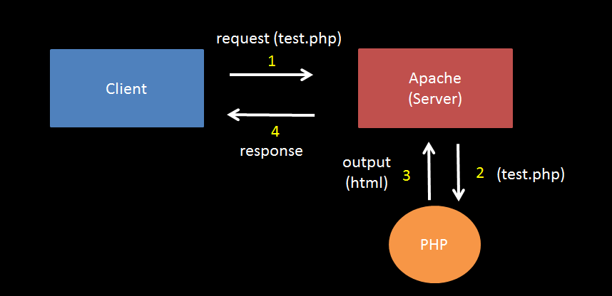

 ## PHP語法基礎
 1. php 標籤: 一個區塊，包裹 php 程式碼，使之可以被執行及輸出
    * eg:
      ```php
      <?php
        echo "123"; // 輸出 123，也可用 html 標籤
        echo "<h1>123</h1>"; // 帶有 h1 效果的 123
      ?>
      ```
 2. 每個指令結束後(每行結尾)一定要加 `;`
 3. 變數宣告:`$變數`
    * eg: `$a = 123; $b = "hello"`
    * 宣告變數與使用變數時皆須在前方加入`$`，可想成不用宣告變數直接使用`$變數`
 4. 字串拼接: `$a . $b`
 5. 字串換行: `$a . "<br>"`
 6. 字串輸出: `echo $a`
 7. 非數字或字串輸出: `var_dump($arr) 、 print_r($arr)`
 7. 基本 if...else 語法
    * eg:
      ```php
      <?php
        $score = 5;
        if ($score >= 60) {
          echo "pass";
        } else {
          echo "fail";
        }
      ?>
      ```
 8. 基本迴圈語法
    * eg:
      ```php
      <?php
        for($i=1; $i<=10; $i++) {
          echo $i;
        }
      ?>
      ```
 9. 基本 array 語法
    * eg:
      ```php
      <?php
        $arr = array(1, 2, 3, 4, "weeeee"); // array 宣告
        sizeof($arr) // array 長度
        $arr[sizeof($arr) - 1] // array 最後一項
        //array 不可用 echo 輸出;
        var_dump($arr); // 輸出 array 每一項的型態與值
        // output : array(5) {[0]=>int(1) [1]=>int(2) [2]=>int(3) [3]=>int(4) [4]=>string(6)"weeeeee"}
        print_r($arr); // 輸出 array 每一項的值
        // output : Array ([0]=>1 [1]=>2 [2]=>3 [3]=>4 [4]=>weeeeee)
      ?>
      ```
 10. 基本 function 語法
     * eg:
       ```php
       <?php
         function add($a, $b) {
           return $a + $b;
         }
         echo add(1, 3);
       ?>
       ```
## Apache 與 PHP 原理簡介

1. Server: 專門處理 request、response、等網路相關的程式，扮演資料往來處理的重要角色
   * eg: Apache，接收 request，呼叫 php，將 php 的 output 做成 response 回傳結果
   * Apache pseudocode: 模擬 Apache 運作
     ```
     function run(request) {
       response = php(request)
       send response
     }
     ```
2. 網址規則:
   * 由 Server 決定
   * 預設: 網址符合資料夾結構，即檔案路徑，eg: localhost/user/test.php
   * 大多網站的 Server 採取預設的網址規則，eg: Apache
   * 網址規則也可由 Server 客製化，eg: facebook.com/profile.php?id=...
