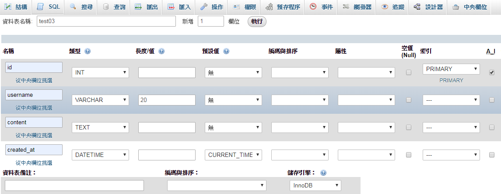
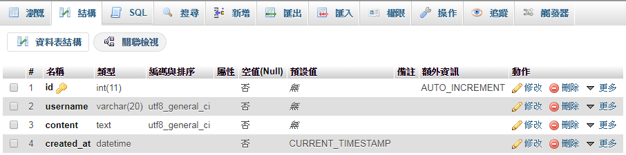
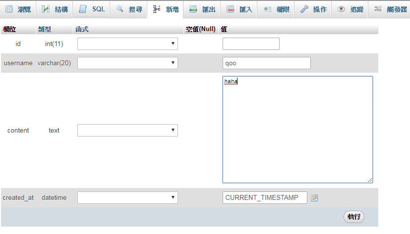
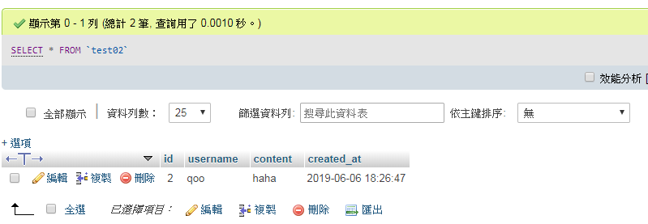
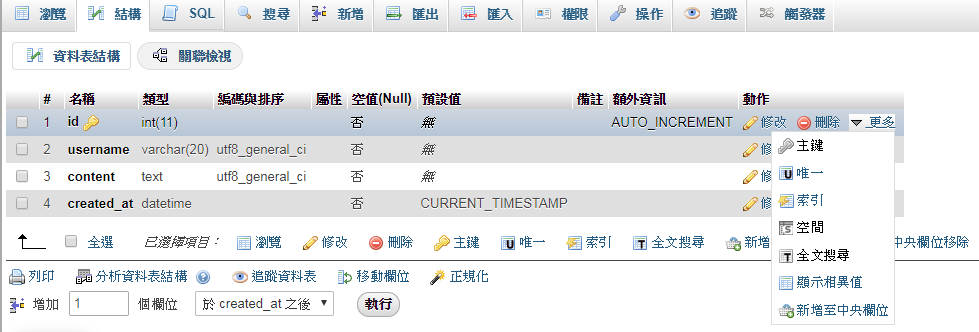

## phpMyadmin 簡介
1. 為 GUI，功能完整的管理資料庫介面，底層為透過SQL指令去撈取資料
2. 本質為用php寫成的一個檔案，eg:index.php，與資料庫本身無關
3. 其他管理資料庫的介面、程式:
   * [adminer](https://www.adminer.org/) :用php 寫成，介面較陽春
   * [sequel Pro](https://www.sequelpro.com/) :直接安裝在電腦上的程式
## Table 表格基礎
1. Schema (結構) : 一般泛指個別 table 內的結構樣式
2. 通常在做一個產品前，必須先想好 table Schema 才能繼續往下做
3. Schema 內固定有的屬性:
   * 名稱: 可想成各欄位的 key 值，即各欄位的名稱，通常會有 id、username、content、created_at
   * 型態: 決定欄位要儲存的資料型態，eg: int、varchar、text
   * 預設值: CURRENT_TIMESTAMP，現在時間，供某些欄位使用
   * 編碼與排序: 可不選，預設由 table 或 database 決定，影響最後儲存是否會變成亂碼
   * 屬性: 型態的屬性，eg: unsigned
   * 空值:是否允許為空
   * 索引:
   * A_I (AUTO_INCREMENT) : 自動遞增，但可能有資料被刪除所以不一定會連續，通常 id 欄位會勾選，保證有唯一且不重複的 id
4. Schema 範例:

    
    
    
    
   * 名稱: id, 型態: int, A_I: 勾選
   * 名稱: username, 型態: VARCHAR (適用於較小的字), 長度/值: 20
   * 名稱: content, 型態: TEXT (適用於較大篇的內容)
   * 名稱: created_at, 型態: DATETIME 時間, 預設值: CURRENT_TIMESTAMP (現在時間點)
     * 用於:記錄這筆資料建立時間
5. 額外設定

    
   * Primary key (PK, 主鍵): 設定之欄位須滿足:  1. 不可為空， 2. 不能重複，為 table 中最重要的欄位，eg: 員工編號、會員帳號
   * Unique: 唯一，Pk 不用再設定，適用於除 pK 外不想重複的東西
   * index: 索引，以空間換取時間，能快速定位、查詢想要的資料，可以是複合的欄位，即將多個欄位建立成一個新的索引，適用於時常需要查詢的欄位
