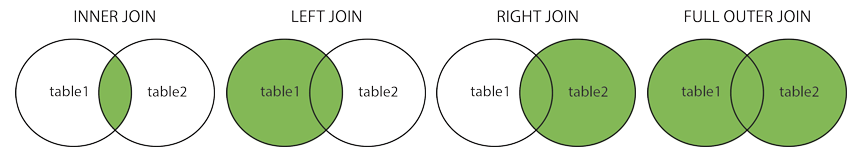
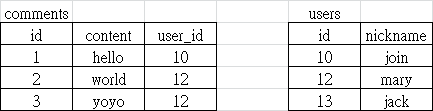

## MySQL 簡介
1. 為 Relational database，關聯式資料庫的實作
2. (https://www.mysql.com/)
3. XAMPP 內的 MariaDB 即為 MySQL 分支，使用上無太大差別
4. (https://mariadb.org/)
## SQL 指令簡介
1. 可在 phpMyAdmin => SQL 內使用
2. 查詢資料，Select
   * 常用，做任何操作前皆可先查詢是否特定條件的資料
   * #### 語法: SELECT 欄位名稱 from \`table名稱\` WHERE 條件
     * \`table名稱\` 外面的反引號一般可略，除非為特殊名稱
     * SELECT * from \`test\` // 查詢 test table 內所有資料
     * SELECT id,content from \`test\` // 查詢 test table 內欄位名稱為 id 與 content 的資料
     * SELECT id as name from \`test\` // 將欄位名稱 id 更改別名為 name，其餘查詢動作不變
     * SELECT * from \`test\` WHERE id=2 // 查詢 test table 內 id=2 的資料
     * SELECT * from \`test\` WHERE id=2  and username='qoo'// 查詢 test table 內同時符合 id=2 與 username='qoo' 的資料
     * SELECT * from \`test\` WHERE id=2  or username='qoo'// 查詢 test table 內符合任一條件 id=2 與 username='qoo' 的資料
3. 新增資料，Insert
   * #### 語法: INSERT INTO \`table名稱\`(\`插入資料欄位名稱\`) VALUES (對應的欄位值)
     * \`插入資料欄位名稱\` 外面的反引號一般可略，除非為特殊名稱
     * INSERT INTO test (username, content) VALUES ("qoo","hehe")
4. 修改資料，Update
   * #### 語法: UPDATE \`table名稱\` SET 欄位名稱=欄位值 WHERE 條件
     * 若 WHERE 條件 省略，則會修改整個 table 的內容
     * UPDATE \`test\` SET username = "user01" , content = "haha" WHERE id = 1
     * //更新 test table 內 id = 1 內 username 與 content 的內容
5. 刪除資料，Delete
   * #### 語法: DELETE FROM \`table名稱\` WHERE 條件
     * DELETE FROM \`test\` WHERE id=1
6. 將資料永久保留、防止資料直接被刪去的方法
   * 方法: 在資料庫結構內多新增一個 boolen欄位 (eg: is_deleted)，當作判斷被刪除與否的 flag
     * 當前台做刪除時，則將 is_deleted 值由 0 設為 1，而非用 Delete 真正刪除資料
     * 最後呈現給前台的資料則為條件 is_deleted = 0 的值
     * SELECT * from \`test\` WHERE is_deleted = 0
   * 優點: 保護重要資料，防止資料被誤刪
   * 缺點: 資料會愈來愈多
7. 連接資料，Join

   

   

   * 類型
     1. Inner Join
        ```
        // 上下指令結果相等
        SELECT comments.id, comments.content, users.nickname
        FROM comments, users
        WHERE comments.user_id = users.id

        SELECT comments.id, comments.content, users.nickname
        FROM comments JOIN users
        ON comments.user_id = users.id
        ```
     2. Left Join
        ```
        SELECT comments.id, comments.content, user.nickname
        FROM comments LEFT JOIN users
        ON comments.user_id = users.id
        ```
     3. Right Join
        ```
        SELECT comments.id, comments.content, user.nickname
        FROM comments RIGHT JOIN users
        ON comments.user_id = users.id
        ```
     4. Full Outer Join
        * mysql 不支援
        ```
        SELECT comments.id, comments.content, user.nickname
        FROM comments FULL OUTER JOIN users
        ON comments.user_id = users.id
        ```
8. [參考資料](https://www.1keydata.com/tw/sql/sql.html)
## SQL 語法簡介
1. 排序， ORDER BY ASC/DESC
   * ASC (ascending、升冪)、DESC (descending、降冪)
   * eg: `SELECT * FROM users ORDER BY time ASC`
2. 分頁， 配合 LIMIT、OFFSET 使用
   * eg: 回傳前 30 筆資料 `SELECT * FROM users LIMIT 30`
   * eg: 回傳 61 ~ 90 筆資料 `SELECT * FROM users LIMIT 30 OFFSET 60`
   * eg: 回傳 61 ~ 90 筆資料 `SELECT * FROM users LIMIT 60, 30`
3. 改名，as
   ```
   //eg 1: 將 table 內的單一行標頭改名
   SELECT created_at as time, nickname as name FROM users

   //eg 2: 將不同 table 改名
   SELECT c.id, c.content, u.nickname as nickname
   FROM comments as c, user as u
   WHERE c.user_id = u.id
   ```
## 疑難雜症解惑
1. 中文變成???
2. 非自身所在時區
3.
