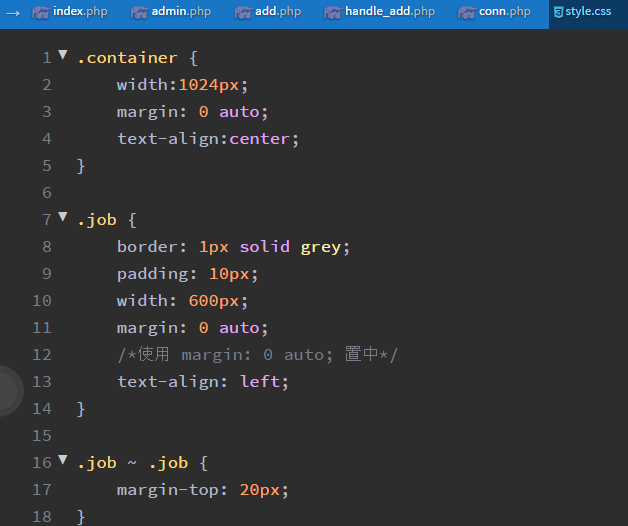
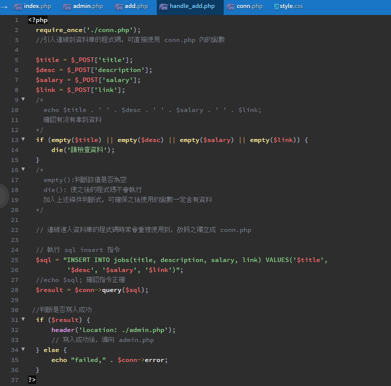
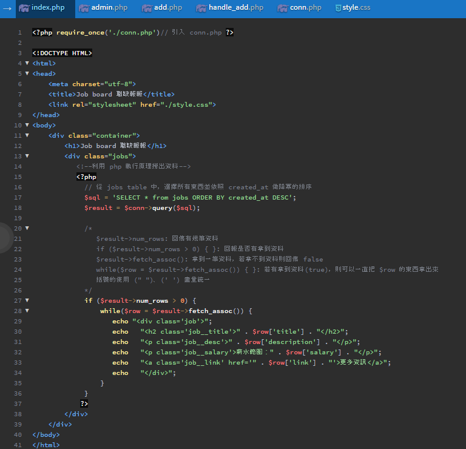
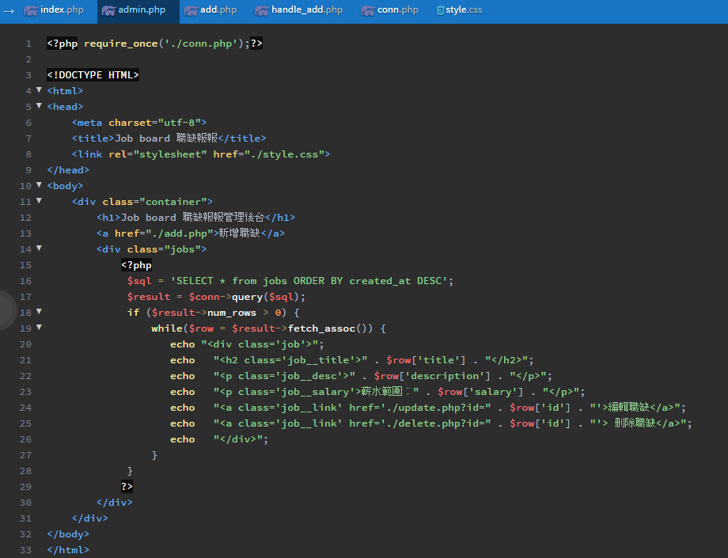
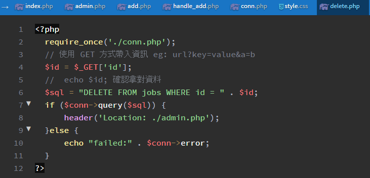
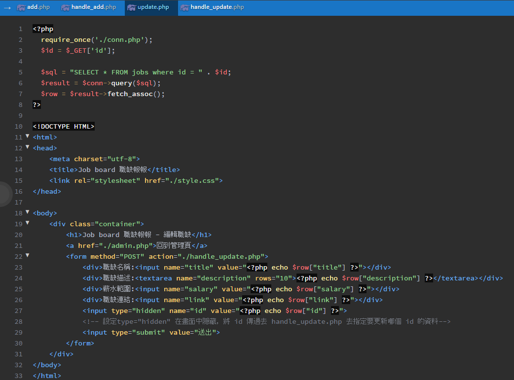
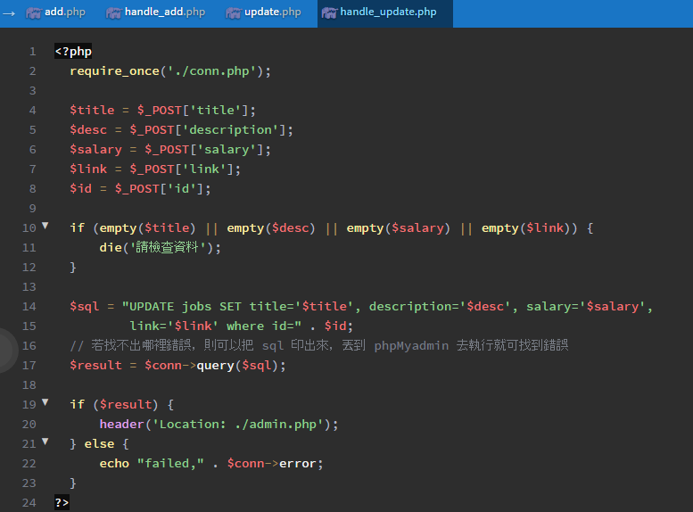

# 實戰: Job board 職缺報報
寫出一個管理後台管理職缺，基本 CRUD (Create、Read、Update、Delete)
還要實作簡單的前台讓大家看到有哪些職缺
## 永遠的第一步: 思考整個產品的全貌
1. 通常由 PM (Product Manager) 負責寫出 user story
   * user story: 以使用者的角度寫出產品應該要有的功能
   * user story eg: 身為使用者，我可以看到 1. 職缺、2. 薪水範圍...
2. 也可以自身經驗構思產品應該要有的功能，可簡單區分為
   * 前台: (職缺的list) => 頁面
     * index.php (展現所有職缺的頁面)
     * job.php?id=1 (展現單個職缺的頁面)
   * 管理後台:
     * admin.php (顯示所有職缺的頁面)，可包含刪除的功能
     * add.php (新增職缺的頁面)，提供表格填入新增的資料
       * handle_add.php (下 sql 指令新增職缺)，為功能型頁面，沒有畫面，新增後返回 admin.php
     * update.php (更改職缺的頁面)
   * 先構思要有那些頁面，再一一實作各頁面的功能
## 規劃出需要的資料結構
1. 職缺名稱
2. 職缺說明
3. 薪資範圍
4. 職缺連結
## 設定 Database
設定 table 的 Schema
 * table name: jobs
 * id, A_I
 * (1) title, VARCHAR(64)
 * (2) description, TEXT
 * (3) salary, VARCHAR(64) // 薪資型態不一定為 INT，可為文字(eg:面議)...等，所以設定為 VARCHAR 型態增加彈性
 * (4) link, VARCHAR(512)
 * created_at, datatime, CURRENT_TIMESTAMP

   
## 實作前端頁面
 先製作靜態頁面，之後再串接資料
 * 前台:
   * index.php (展現所有職缺的頁面)

     

     

     
 * 管理後台:
   * admin.php (顯示所有職缺的頁面)

     

     
   * add.php (新增職缺的頁面)

     

     
## 實作後台功能並與資料庫串接
實作 add.php 內表單資料送出的位置 handle_add.php，即實作新增職缺的功能
* handle_add.php

  
* conn.php (獨立出連線進入資料庫的程式碼)

  
* 在資料庫新增資料成功的畫面

  
## 撈取資料庫資料
串接資料，取代靜態頁面
* index.php

  
* admin.php

  
## 實作刪除與編輯功能
* delete.php (刪除職缺)

  
* update.php (編輯職缺): 與 add.php 頁面相似，差別在於自動填入資料

  
* handle_update.php : 與 handle_add.php 相似，差別在於編輯資料

  
## 進階練習：加上職缺到期日
1. 在 add.php 新增、編輯一個職缺到期日的欄位，可以選擇日期及時間
2. 可以選擇時間是否顯示在前台
3. 若過了到期日，則該筆資料不會顯示在前台，資料並非被刪除，而是仍存於資料庫
## 進階練習：新增排序功能
1. 在 add.php 新增一個排序(權重)的欄位，使前台可以依照排序的欄位輸出資料
## 魔王練習：開放會員註冊並新增管理職缺
1. 在 index.php 新增一個 link: 註冊會員
2. 註冊會員後，進入會員專屬的後台，可以管理會員自己的職缺
3. 新增一個 superadmin 可以管理所有職缺
4. 牽涉到權限上的設計
## 魔王練習：管理員可以審核職缺
1. 新增狀態:會員新增職缺後，其狀態變成審核中，需管理員手動審核通過後，該職缺才能出現在前台，反之則不會出現在前台
2. 管理員可以直接將不合格的職缺下架
