# 實戰: Blog 部落格
分類功能、發表文章、關於我頁面
## 永遠的第一步: 思考整個產品的全貌
* 參考: (https://blog.huli.tw)
* 前台
  * index.php 所有文章 (首頁)
  * article.php?id=x 單一文章
  * about.php 關於我
* 後台
  1. 基本: admin.php 後台管理頁面 (大同小異，目的皆是如何管理資料)
     * add.php 新增文章
     * handle_add.php
     * update.php
     * handle_update.php
     * delete.php
  2. 為了管理分類而新增: admin_category.php
     * add_category.php
     * handle_add_category.php
     * update_category.php
     * handle_update_category.php
     * delete_category.php
## 規劃出需要的資料結構
1. articles
   * id
   * title
   * content
   * category_id
   * created_at
2. categories
   * id
   * name
   * created_at
3. 註: articles 與 categories 藉由 category_id 做關聯
## 建置資料庫
1. articles schema

   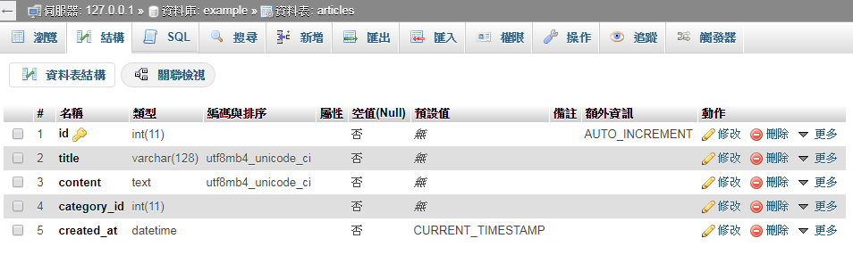
2. categories schema

   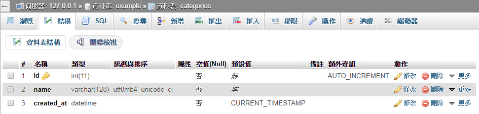
## 後臺管理分類實作
1. admin_category.php (刻版)

   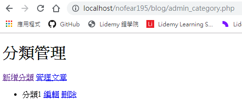

   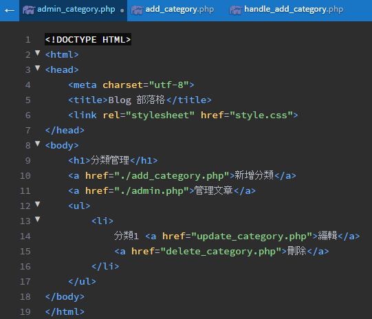
2. add_category.php

   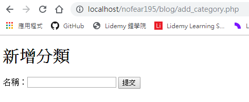

   
3. handle_add_category.php

   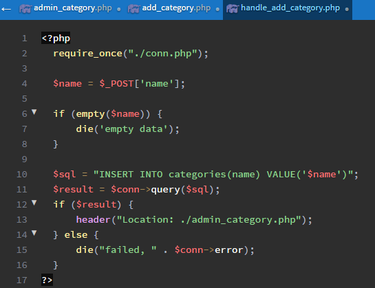
4. admin_category.php (串接)

   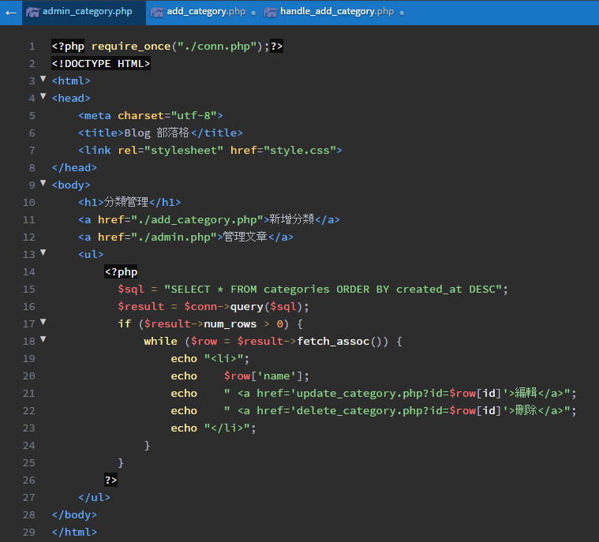
5. delete_category.php

   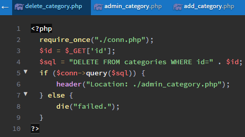
6. update_category.php

   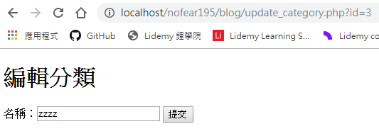

   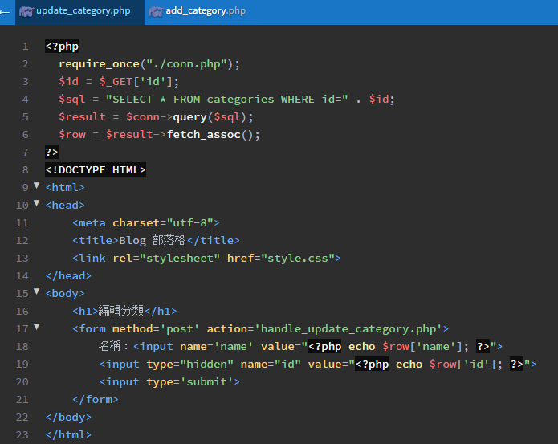
7. handle_update_category.php

   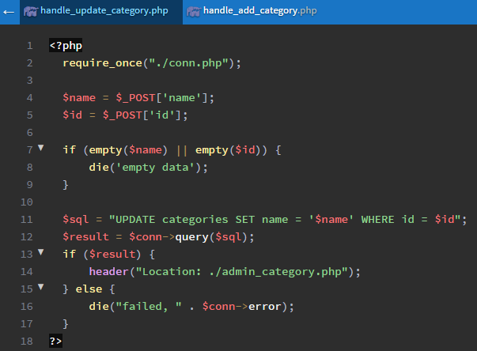
## 後臺管理文章實作
* 功能大同小異，直接複製管理分類的檔案再修改即可
1. admin.php

   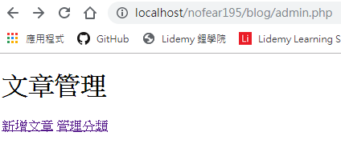

   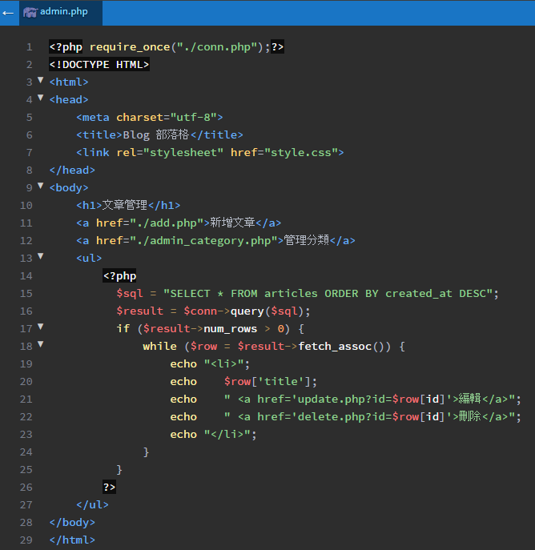
2. add.php

   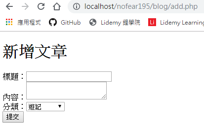

   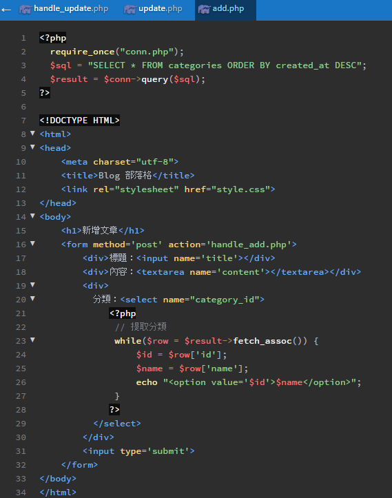
3. handle_add.php

   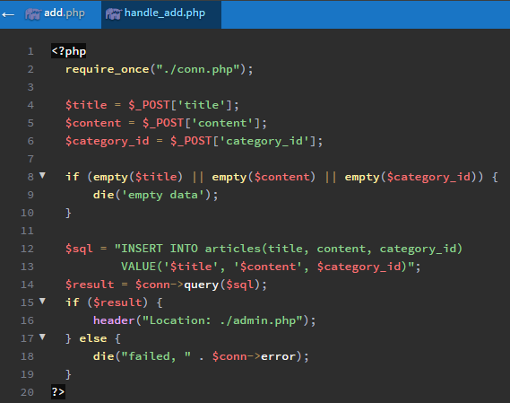
4. delete.php

   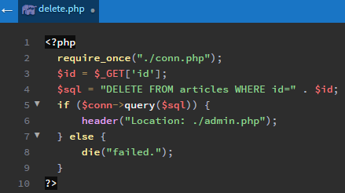
5. update.php (要用到 add.php)

   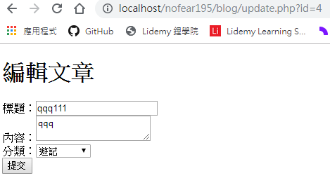

   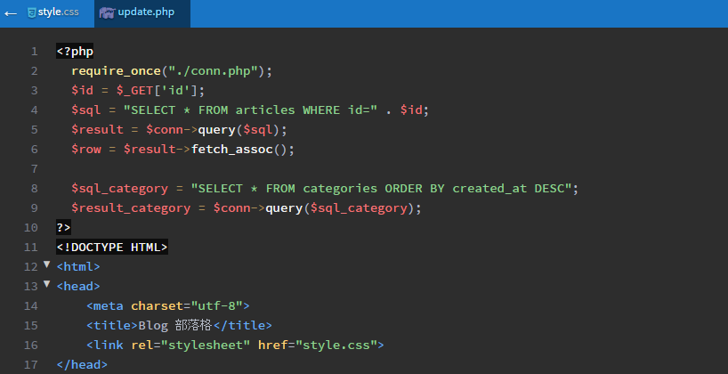

   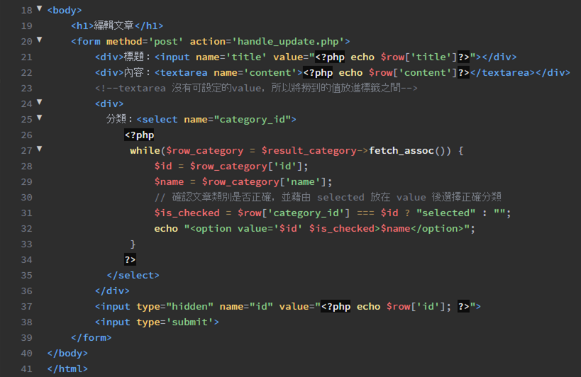
6. handle_update.php

   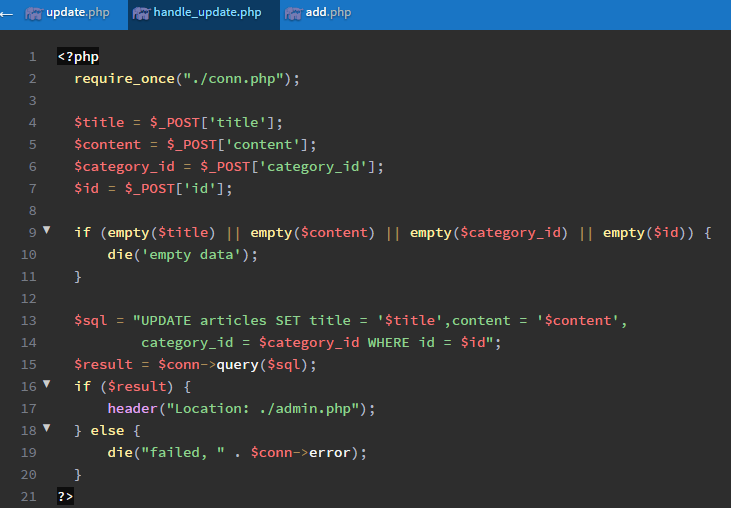
## 實作前台頁面
1. index.php

   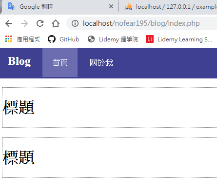

   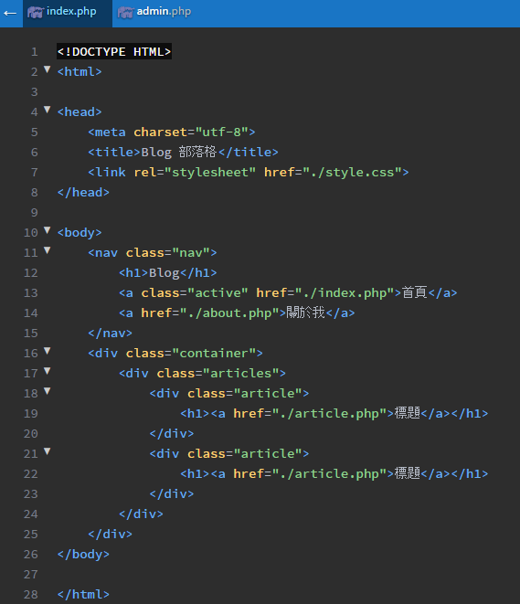
2. style.css

   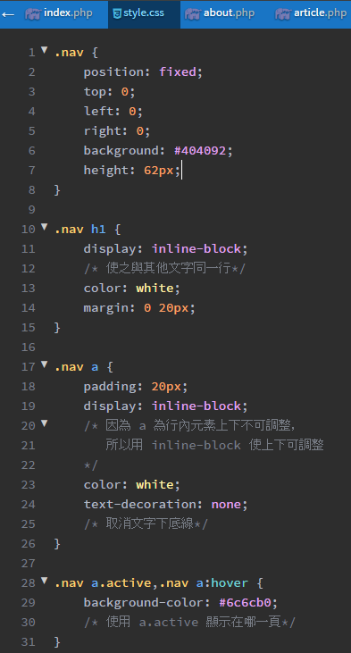

   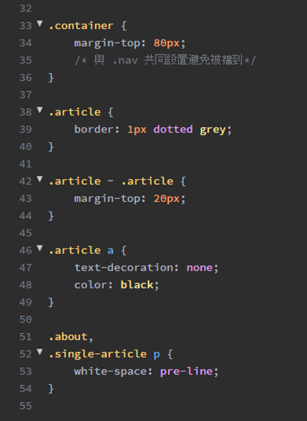
3. about.php

   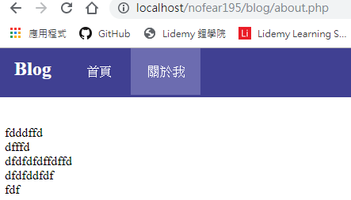

   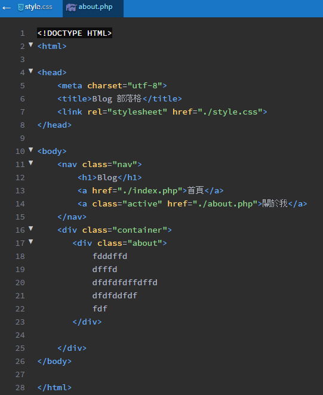
4. article.php

   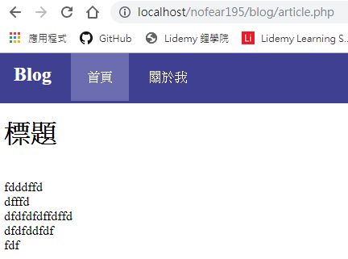

   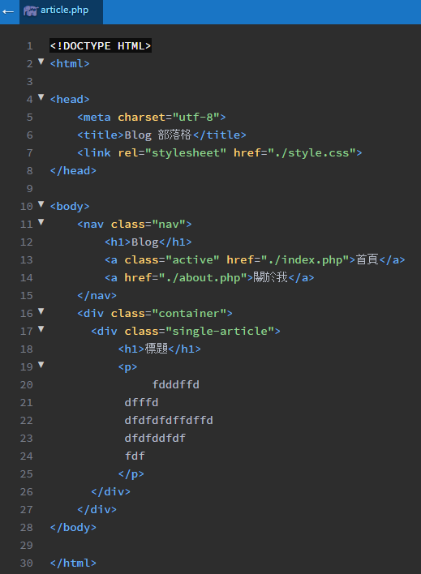
## 把全部串連起來
1. index.php (參考部分 admin.php 做串接)

   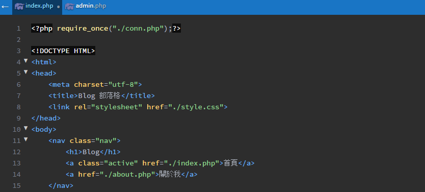

   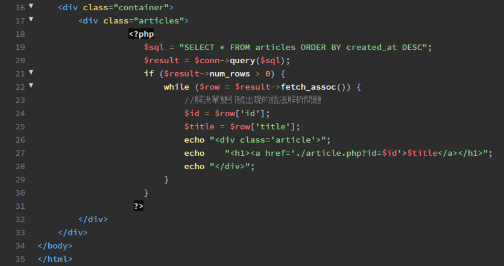

   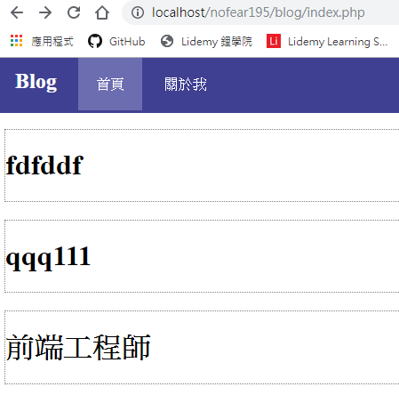
2. article.php

   

   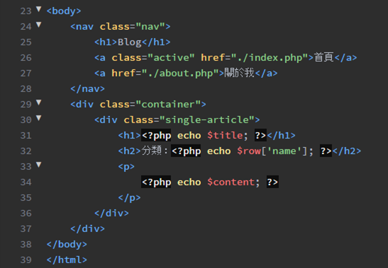

   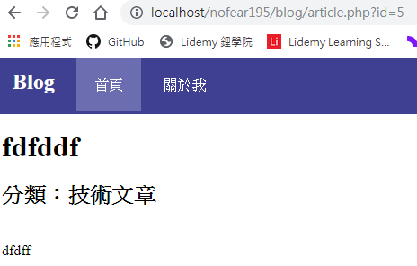
## 進階練習：新增草稿
* 新增狀態：
  1. 草稿 (前端看不到，後端看得到)
  2. 發布中 (前後端都可以看到)
## 進階練習：加上關於我的管理頁面
* 後台新增關於我的管理頁面，使之串接到前台的關於我頁面
## 進階練習：加上評論功能
* 在每篇文章下新增評論的功能，不用註冊，可以輸入暱稱
## 魔王練習：一篇文章可以有多個分類
## 魔王練習：搜尋功能
* 新增搜尋頁面
* 輸入關鍵字後，系統將符合的文章挑出來
* 符合的定義：標題或內容有涵蓋搜尋的關鍵字
