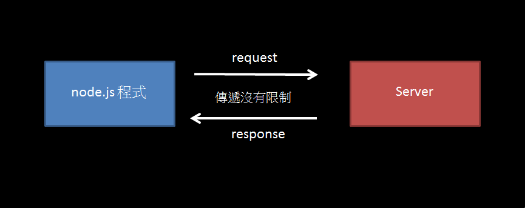
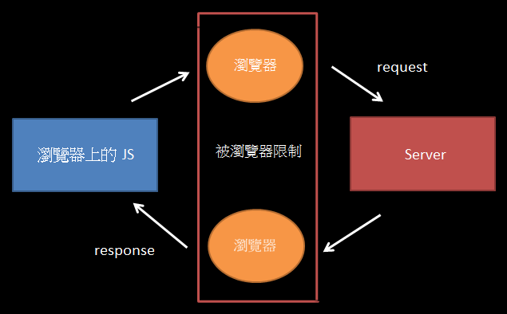

## 在網頁寫程式時關注的三大面向
1. 介面: 如何改變介面 (UI)，eg: 用 js 改變 html、css
2. 事件: 如何監聽事件並做出反應，eg: click 後的反應
3. 資料: 如何與 Server 交換資料
* 完成以上三點即可做出任何網路相關的東西
***
## JavaScript 與 borwser 的溝通
1. JS 執行環境:
   1. 在 node.js (執行環境) 上執行: `node + 檔名`
   2. 在 browser 上執行
      * 在 html檔案內加入`<script></scripi>`並在標籤內撰寫程式
      * srcipt 標籤放置位置會因為 JS 是由上而下逐行解譯，而影響執行後的結果
      * 通常將`<script></srcipt>` 放置在`</body>`( body結束元素 )前
      * `<srcipt src="./index.js"></scripi>`，將 js 獨立成一個檔案，再用 src 連結
   3. 在 node.js 與 borwser 上的 js 差異
      * 兩者語法皆為 JavaScript
      * 兩者為不同的執行環境，在支援度上有所不同
      * eg: node.js 上 `require('')` 用法，在 borwser 不支援
2. DOM，Document Object Model

    

   * 是 html、xml 和 SVG 文件的程式介面
   * 可以理解成把 Document 轉換成 Object，有階層的結構
   * DOM 為 borwser 與 JS 之間的橋樑，讓 JS 可以與 browser 做溝通
   * JS 可以透過 DOM 取得元素，並改變元素
3. 選取想要的元素，getElement
   * document 為 browser 提供的特殊物件，並將很多的 function 放在 document 上
   * 因為這些元素都是放在 document 上，所以接續`document.`後面使用
   * `document.getElementsByTagName('')`: 獲取所有此 tag name 的元素
   * `document.getElementsByClassName('')`: 獲取所有此 class 的元素
   * `document.getElementById('')`: 獲取所有此 id 的元素
   * `document.querySelector('')`； 獲取第一個符合 css selector name 內的元素
   * `document.querySelectorAll('')`:選取所有符合 css selector name 內的元素，回傳一個 list，非陣列但可以當成陣列使用
4. 改變元素的 CSS
   1. `變數.style.屬性='屬性值'`: eg: element.style.background='red'
      * "style." 後方屬性內容不可含有 "-"，即 JS 內 object 的用法
      * 上述解決方法可用 [] 將屬性以字串的方式包裹，或是以 "camel case" 方式遇到新的單詞其開頭轉大寫
      * eg: 可用 `.style['padding-top']`、`.style.paddingTop` 代替 `.style.padding-top`
      * 實作上選取到元素再用 ".style" 改變元素 CSS ，其程式或過於冗長，會傾向分開寫，較少使用此方法
   2. * 先改變 class 在讓 class 負責不同的 style
      * 用 JS 動態加入 class: `變數.classList.add('class name')`
      * 用 JS 動態移除 class: `變數.classList.remove('class name')`
      * 用 JS 動態切換加入移除 class: `變數.classList.toggle('class name')`
      * 此作法較為常用
5. 改變內容
   1. `變數.innerText='值'`: 改變元素內的文字內容
   2. `變數.innerHTML='值'`: 改變元素標籤內所有的內容，不含元素自身標籤
   3. `變數.outerHTML='值'`: 改變所有含元素本身標籤的所有內容，可以變成一個新的元素
6. 插入與刪除元素，
   * appendChild 與 removeChild 前要先知道其 parent
   * `變數.removeChild(document.querySelector('變數 child'))`: 移除元素內的 child
   * `document.creatElement('標籤')`: 新增元素
   * `document.creatTextNode('文字')`: 新增純文字
   * `變數1.appendChild('變數2')`: 在變數1的元素內的最後面，新增變數2的元素
***
## JavaScript 網頁事件處理
1. 事件監聽，event listener
   * `變數.addEventListener('event name', callback function)`
   * event: 要觸發事件的名稱，有 click、scroll、keypress、keydown 等
   * anonymous function: 任何沒有 function name 的 function 皆可稱之，與 callback function 沒有關係
   * callback function 可分為兩種
     1. 沒有使用傳入參數，且大多為 anonymous function : `function() {}`
     2. 有使用傳入參數 (event、e、任取): `function(e) {}`
        * 參數 (event、e、任取) 為 borwser 呼叫而來的變數，進而拿到跟事件相關的東西
        * eg: e.target: 觸發了哪個元素
2. 表單事件處理，submit
   * 在表單送出前，對事件作處理，eg:使表單不要送出，通常用於表單驗證
   * `e.preventDefault()`: 阻止 browser 預設行為，可用於密碼的驗證，超連結等
   ```
   <form class='login-form'>
      <div> username: <input name='username' /> </div>
      <div> password: <input name='password1' type='password' /> </div>
      <div> password again: <input name='password2' type='password' /> </div>
   </form>
   <script>
      const element = document.querySelector('.login-form');
      element.addEventListener('submit', function(e){
        const input1 = document.querySelector('input[name=password1]');
        const input2 = document.querySelector('input[name=password2]');
        if(input1.value !== input2.value) {
          alert('密碼不同');
          e.preventDefault();
        }; // 驗證兩次的密碼輸入是否相同
        })
   </scrtpt>
   ```
3. DOM 事件傳遞機制: 捕獲與冒泡

   

   * 先捕獲，在冒泡
   * 在 DOM 內的元素因為有了上下階層的關係，所以在事件觸發後，會先由根節點往下傳遞至目的地 (觸發處) 再回傳至根節點
   * Capture pharse: 捕獲階段，即由根節點往下傳遞至觸發處的過程
   * Target pharse: 目標階段，觸發處
   * Bubbling pharse: 冒泡階段，即由除發處往上傳遞至根節點的過程
   * `addEventListener('event name', callback function, boolen)`
     * 若 boolen = true，則可將 addEventListener 掛在 Capture pharse 上
     * 若 boolen = false，則可將 addEventListener 掛在 Bubbling pharse 上，為預設值
     * 在 Target pharse 中，則會以掛載先後順序顯示其階段
   * `window.addEventListener('click', function(e){ e.preventDefault()}, true)`
     * 在 window (root) 或 Capture pharse 任一過程中 ，呼叫 preventDefault 其效果會一直傳遞至 Target pharse，使其掛在捕獲階段的效果失效，最後在頁面上的效果完全失效
   * 阻止事件傳遞: `e.stopPropagation()`，只觸發本身事件，後面其他事件不傳遞、不觸發
   * `window.addEventListener('click', function(e){ e.stopPropagation()}, true)`
     * 在 window (root) 直接阻止其他事件觸發
   * `e.stopImmediatePropagation()`，只觸發本身事件，立刻阻止後面其他事件傳遞、觸發
     * 因為一個元素可放進多個 addEventListener 同時觸發事件，所以可用於限制觸發單一事件
   * [DOM 的事件傳遞機制：捕獲與冒泡](https://blog.techbridge.cc/2017/07/15/javascript-event-propagation/)
4. 新手 100% 會搞錯的事件機制問題
   * 問題一:addEventListener 內的 callback function 只有在事件觸發當下才作用
   ```
   <div class='outer'>
      <button class='btn'>1</button>
      <button class='btn'>2</button>
   </div>
   <script>
      const elements = document.querySelectorAll('btn')
      for (var i=0; i<elements.length; i++) {
        element[i].addEventListener('click', function()) {
          alert(i+1)
        })
      }
      /*
       result: alert 只顯示 2
       因為 callback function 在 click 才觸發
       而 for loop i 的值早跑到 element.length，離開迴圈
      */
   </script>
   ```
   * 問題一解決方法: 脫離使用 for loop i 的值，改用 e.target 配合自訂義屬性
   ```
   <div class='outer'>
      <button class='btn' data-value='1'>1</button>
      <button class='btn' data-value='2'>2</button>
      // 通常要存資訊不會用文字，而是會自訂義以 data 開頭的屬性 eg: data-value=''
   </div>
   <script>
      const elements = document.querySelectorAll('btn')
      for (var i=0; i<elements.length; i++) {
        element[i].addEventListener('click', function(e)) {
          e.target.getAttribute('data-value')
        })
      }
    </script>
   ```
   * 問題二: 下方動態新增的元素，不會自動帶入上方面寫的 addEventListener 內
   ```
   <div class='outer'>
      <button class='add-btn'>add</button>
      <button class='btn' data-value='1'>1</button>
      <button class='btn' data-value='2'>2</button>
   </div>
   <script>
      let num = 3
      const elements = document.querySelectorAll('btn')
      // 手動將兩個 btn 加入 addEventListener
      for (var i=0; i<elements.length; i++) {
        element[i].addEventListener('click', function(e)) {
          e.target.getAttribute('data-value')
        })
      }

      document.querySelector('.add-btn').addEventListener('click',
        function(){
          const btn = document.creatElement('button');
          btn.setAttribute('data-value',num);
          btn.classList.add('btn');
          btn.innerText = num;
          num++;
          document.querySelector('.outer').appendChild(btn);
      })
      // 動態新增的元素
    </script>
   ```
   * 問題二解決方法: 使用「冒泡」機制搭配 event delegation (事件代理)
     * event delegation (事件代理) 常用的原因如下
       1. 有效率，不用浪費對每個事件作監聽
       2. 可處理動態新增的元素
   ```
   <div class='outer'>
   // class outer 包覆在外面，在裡面元素冒泡時，一定會包含此 class
      <button class='add-btn'>add</button>
      <button class='btn' data-value='1'>1</button>
      <button class='btn' data-value='2'>2</button>
   </div>
   <script>
      let num = 3
      document.querySelector('.add-btn').addEventListener('click',
        function(){
          const btn = document.creatElement('button');
          btn.setAttribute('data-value',num);
          btn.classList.add('btn');
          btn.innerText = num;
          num++;
          document.querySelector('.outer').appendChild(btn);
       })

      document.querySelector('.outer').addEventListener('click',
        function(e) {
            if (e.target.ClassList.contains('btn')) {
            // 看這個 class 是否包含 btn
              alert(e.target.getAttribute('data-value'))
            }
      })
      // 監聽所有元素只用一個 .outer 的 addEventListener
    </script>
    ```
5. 綜合示範: [簡易密碼產生器](./demo_passwordGenerator.md)
6. 綜合示範: [動表單通訊錄](./demo_addressBook.md)
***
## 瀏覽器的資料儲存
1. 探討原因: "HTTP protocol is stateless"
2. 因為 HTTP 協定是無狀態的，即 Server 無法得知前後 request 差異，所以需要方法自動將資料帶入 Server
3. 使用 browser 與 Servere 之間溝通來儲存資料的方法: Cookie
   * 為最古老的資料儲存方法
   * 一種小型文字檔，會自動帶到 Server
   * Server 可以設定或讀取 Cookies 中包含的資訊，藉此維護用戶與 Server 對談中的狀態
   * Server 會在 response 內的 header:"Set-Cookie:..." 放資料，只要　browser 偵測到，便會將資料寫入 Cookie，之後所有的 request 會自動把 browser 的 Cookie 帶上去，使 Server可以辨識身分
   * eg: 第一次 A -> login -> Server，Server 回傳一個似通行證的東西於 set-Cookie 內
         下一次 A with 通行證 -> Server，通行證放於 Cookie 內，Server 可辨識同為 A
   * browser 只會將與其連線的 domian 帶入相對應的 Cookie
   * 可在 dev tool 內的 Application 與 Network 中檢視
   * (https://zh.wikipedia.org/wiki/Cookie)
4. 單純在 browser 儲存資料的方法: Local Storage
   * 最常使用的資料儲存方法
   * `window.localStorage`: window (browser) 的全域物件提供 localStorage 的用法，即 browser 提供的 API
   * window.localStorage 後面可接: .setItem('')、getItem('')、removeItem('')
   * 儲存方式為 `key:'value'`: value 為字串，可以把物件轉為 JSON 字串存入，取出時，再將 JSON 字串轉回物件即可
   * 儲存資料可在 dev tool -> Application -> Local Storage 檢視存入的東西
   * (https://developer.mozilla.org/en-US/docs/Web/API/Window/localStorage)
   * 演練: 將文字儲存於 Local Storage 內，重新整理頁面後，會自動帶入儲存的文字
     * 可用於填表單，不小心回到上一頁，再回來填表單，其內容還在
   ```
   <div class='app'>
     <input class="text" / > <button>儲存</button>
   </div>
   <script>
      const oldvalue = window.localStorage.getItem('text');
      document.querySelector('.text').value = oldvalue;
      // 重新整理頁面後，從 localStorage 拿出儲存的值

      document.querySelector('button').addEventListener('click', function() {
        const value =  document.querySelector('.text').value;
        window.localStorage.setItem('text',value) // key= 'text' , value = value
      })
      // 將文字輸入 input 後儲存於 localStorage
   </script>
   ```
5. 短暫儲存資料的方法: Session Storage
   * 用法與 localStorage 相同，而其全域變數則為 `window.sessionStorage`
   * 不同分頁不能共用同一個 Session Storage
   * Session Storage 作用時效僅在該分頁開起、存在的狀態，關閉分頁則無作用且儲存資料消失
   * 通常用於儲存短暫的資訊
***
## 網頁與伺服器的溝通
1. review:

   
   * browser 發出一個 GET request 至連結，其 Server 回傳一個 response，browser 再 render 出頁面
   * request、response 格式可為 .html 檔案或 JSON 格式的檔案
   * 可以在 dev tool -> Network 看到所有情形
2. node.js 與 瀏覽器上的 JS 根本的差異

   
   * node.js 直接發出 request 至 Server 中間沒有任何干擾
   * 用 node.js 沒有限制

   
   * 瀏覽器上的 js 透過瀏覽器，瀏覽器發出 request 至 server
   * Server 透過瀏覽器，瀏覽器回傳 response 至瀏覽器上的 js
   * 用瀏覽器上的 js 會被瀏覽器規則限制
   * 瀏覽器的規則限制: 制止做一些事情、加一些東西，eg；額外資訊、版本
3. 透過表單 form 傳資料
   * 步驟:
     1. 利用表單傳 request 至 server
     2. server 回傳 response 至 browser
     3. browser 會直接 render response，即直接改變網址 (換頁) 到 response 回應的位置
   * 單純透過 html 元素攜帶參數至 response 回應的頁面
   * method = GET，參數會附加在網址上面
   * method = POST，參數會放在 body 內，常用於保護登入時輸入的帳號密碼
   * 可以在 dev tool -> Network ，點選 Preserve log 按鈕查看
4. df
